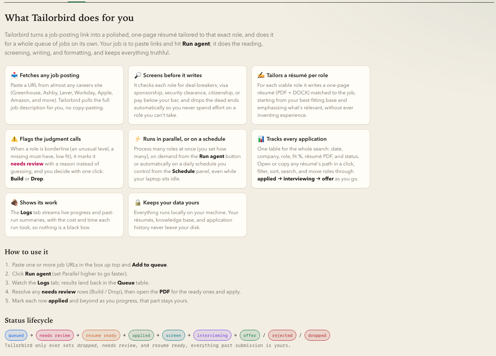
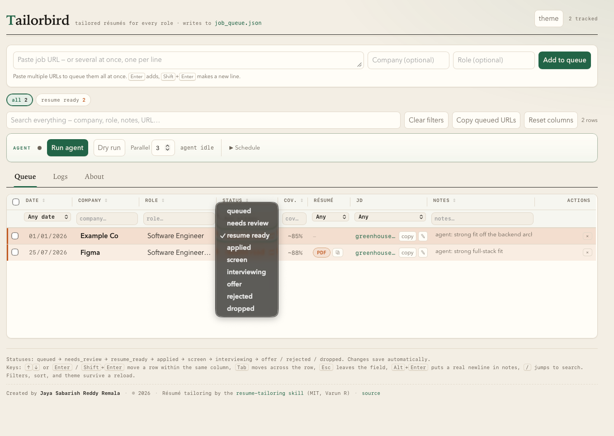
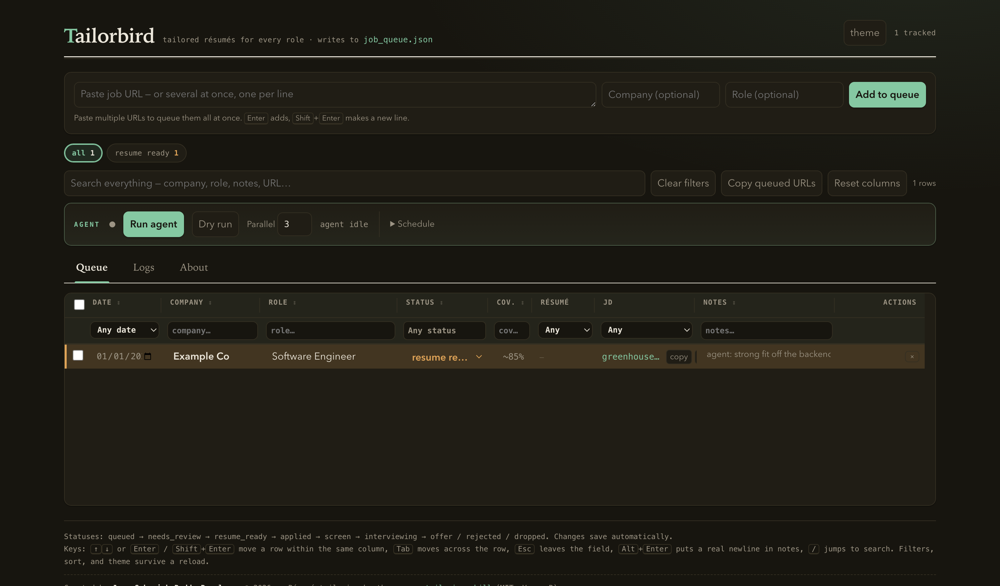
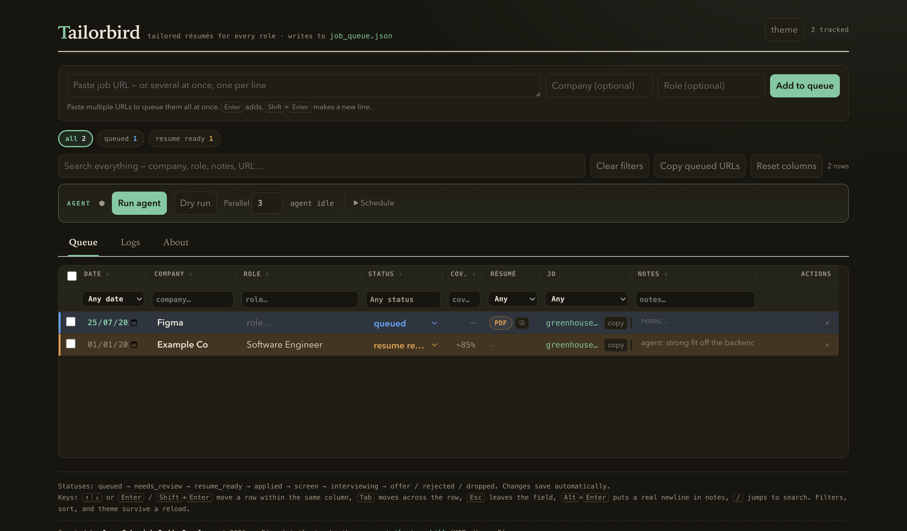
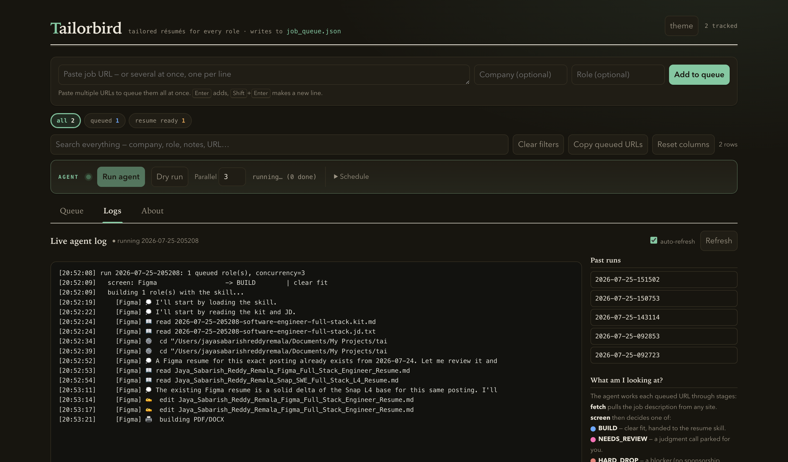
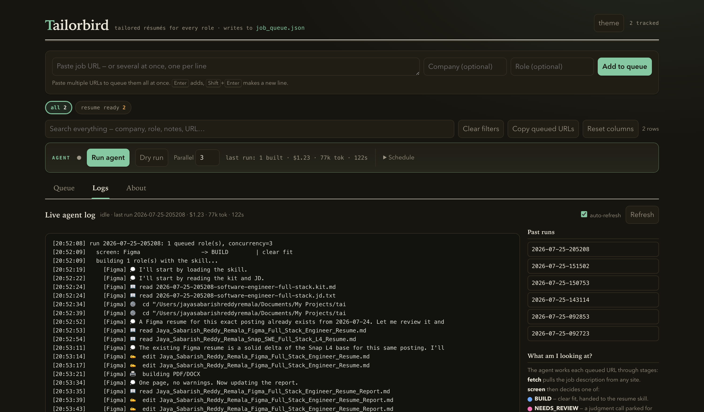
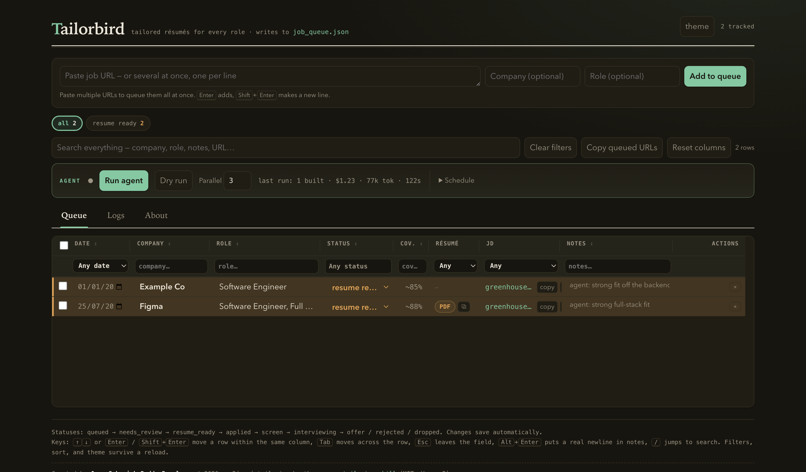

# Tailorbird

*Tailored résumés for every role, on autopilot.* (Named for the tailorbird, which stitches
leaves into a nest, this one stitches your experience to fit each job.)

An end-to-end system that turns a **job-posting URL** into a **tailored, one-page
résumé** (PDF + DOCX) with factual integrity, and does it autonomously at scale. You
paste URLs into a local web tracker, click **Run agent**, and come back to finished
résumés, dropped roles (with reasons), and a short list of judgment calls for you to
decide.

It has three cooperating parts:

1. **The `/resume-tailoring` skill** — a Claude Code skill that is the single source of
   truth for *how* a résumé is tailored (research, archetype selection, matching,
   one-page generation, truthfulness rules). A copy is **vendored in `skill/`** so anyone
   can read and edit it; at runtime Claude Code loads it from
   `~/.claude/skills/resume-tailoring/`. See [The skill](#the-resume-tailoring-skill).
2. **The agent** (`agent/`) — a pure-Python orchestrator that does all the mechanical,
   token-free work (fetch each JD, screen eligibility, assemble a compact context,
   commit results) and invokes the real skill **headlessly** (`claude -p`) only for the
   actual authoring.
3. **The tracker** (`tracker/`) — a stdlib HTTP server + single-file web UI that is the
   control surface: add URLs, run the agent, watch live logs, review borderline roles,
   open/copy résumés, and manage a background schedule.

The candidate's reusable knowledge (facts, résumé archetypes, boundaries, metrics) lives
in **`resumes/_index/LIBRARY.md`**, and every generated résumé is stored under
**`resumes/{Company}/`**.

---

## Table of contents

- [Why Tailorbird (inspiration & who it helps)](#why-tailorbird-inspiration--who-it-helps)
- [Quick start](#quick-start)
- [UI Overview](#ui-overview)
- [How it works — a 4-step walkthrough](#how-it-works--a-4-step-walkthrough)
- [Prerequisites](#prerequisites)
- [Installation (step by step, per device)](#installation-step-by-step-per-device)
- [Architecture](#architecture)
- [Directory layout](#directory-layout)
- [Data model](#data-model)
- [The agent pipeline (detail)](#the-agent-pipeline-detail)
- [The eligibility / fit screen](#the-eligibility--fit-screen)
- [Token & time optimizations](#token--time-optimizations)
- [The tracker UI](#the-tracker-ui)
- [HTTP API reference](#http-api-reference)
- [Component reference](#component-reference)
- [The `/resume-tailoring` skill](#the-resume-tailoring-skill)
- [Running it](#running-it)
- [Customize it for you](#customize-it-for-you)
- [Safety guarantees](#safety-guarantees)
- [Extending the system](#extending-the-system)
- [Troubleshooting](#troubleshooting)
- [Known limitations](#known-limitations)
- [License & contributing](#license--contributing)

---

## Why Tailorbird (inspiration & who it helps)

**The idea.** Whether you get an interview should depend on your *experience and
capabilities*, not on how much time you can spend rewriting a résumé for every posting.
Tailoring one résumé per role is genuinely valuable — it materially raises callback rates —
but doing it well, for dozens of roles, is slow, repetitive work that punishes people who
have less time (working parents, people in demanding jobs, international applicants writing
in a second language). Tailorbird automates that labor while keeping a hard line on
honesty: it reframes and emphasizes what's genuinely yours, and it never invents
experience.

**The name.** The tailorbird stitches leaves together to build its nest. This one stitches
*your* real experience to fit each job.

**What inspired it.**
- The tailoring *method* comes from the open-source `/resume-tailoring` Claude Code skill
  (MIT, by Varun R). Tailorbird wraps that skill in automation rather than reinventing it,
  so quality equals a careful, hand-guided session.
- The **agent-over-skill** design (deterministic Python for the mechanical 80%, the model
  only for authoring) came from watching where tokens and time actually went, and from the
  skill's own "token optimization" guidance.
- The **human-in-the-loop `needs_review` valve** exists because some calls (an unusual
  level, a missing must-have, a borderline fit) genuinely need a person — so the agent
  parks those instead of guessing.

**Who benefits.**
- **High-volume job seekers** — apply to many roles without the per-role grind; a batch that
  took an evening now runs in minutes while you do something else.
- **Career switchers** — the archetype/reframing engine surfaces transferable experience for
  roles adjacent to your background.
- **Non-native résumé writers** — get clean, idiomatic, role-matched phrasing without
  fighting the blank page.
- **Busy people** — schedule it; results and a review list are waiting when you're back.
- **Anyone who values honesty** — truthfulness boundaries are enforced; it will flag a poor
  fit rather than pad it.

---

## Quick start

```bash
# 1. Start the tracker (opens http://localhost:8765 in your browser)
python3 tracker/tracker.py

# 2. In the UI: paste one or more job URLs → "Add to queue" → "Run agent".
#    Watch progress on the Logs tab; review any "needs review" rows.

# 3. Or run the agent from the CLI:
python3 agent/run.py --dry-run          # classify the queue, write nothing
python3 agent/run.py --once             # process the queue (one role at a time, reused session)
python3 agent/run.py --only "<url>"     # process a single queued URL
```

---
## UI Overview




## How it works — a 4-step walkthrough

The whole loop is: **paste a job URL → click Run agent → watch it work live → collect the
tailored résumé.** Here it is end-to-end in the tracker UI (screenshots use a sanitized
demo queue).

### 1. Start with your queue

Launch the tracker (`python3 tracker/tracker.py`) and open `http://localhost:8765`. The top
bar is where you paste job URLs; below it the **agent bar** (Run agent / Dry run / model
+ effort pickers / Base session / Schedule) and the **Queue / Logs / About** tabs. The queue is a dense,
inline-editable ledger — every field autosaves.



### 2. Add a job URL

Paste one or more posting URLs into the box and hit **Add to queue** (or just `Enter`). A
new row lands with status **`queued`** — no company or role yet; the agent fills those in
when it fetches the posting. Here a Figma role has been queued.



### 3. Run the agent — and watch it work, live

Click **Run agent**. Tailorbird jumps to the **Logs** tab and streams a **live, timestamped
feed of exactly what it's doing right now** — fetching the JD, screening eligibility, then,
inside the résumé skill, reading the kit, authoring the résumé, and building the PDF/DOCX.
Each tool call becomes one readable line (🔎 research · 📖 read · ✍️ edit · 🖨️ build). The
right rail lists past runs and a plain-language legend of the stages.



When the role finishes, the banner flips to **idle** with the run's totals, and the log
prints the outcome plus a **breakdown of where the time went** — so the bottleneck is
obvious at a glance:



```
  BUILT        Figma (~88%) · $1.23 · 77k new tok · 122s
    [Figma] breakdown: 0 web search(es) · 1 PDF build(s) · 17 turns
```

(This exact run: one page on the first try — a single PDF build — in 122 seconds.) The agent
only ever sets `dropped`, `needs_review`, or `resume_ready` — everything from `applied`
onward stays yours.

### 4. Collect the tailored résumé

The row flips to **`resume_ready`** with a coverage estimate and a **PDF** pill (opens the
one-page résumé) plus a copy-path button. The DOCX and a coverage/gaps report are written
alongside it under `resumes/{Company}/`.



That's the entire loop. Queue a dozen URLs, click once, and come back to finished résumés
plus a short list of any borderline roles parked in `needs_review` for you to judge.

---

## Prerequisites

| Dependency | Why | Notes |
|---|---|---|
| **Python 3** | tracker + agent (standard library only, no `pip install`) | tested with the system/anaconda python |
| **Claude Code CLI** (`claude`, v2.x) | the agent invokes the real skill headlessly | must be logged in; `claude -p` is used |
| **`/resume-tailoring` skill** | defines all tailoring quality | vendored in `skill/`; install to `~/.claude/skills/resume-tailoring/` (see below) |
| **Node.js** + global **`docx`** package | `resumes/_assets/gen_docx.js` builds the DOCX | `npm i -g docx` (auto-located; override with `TAILORBIRD_DOCX`) |
| **Google Chrome / Chromium** | headless PDF rendering in `build_resume.py` | auto-detected on macOS/Linux/Windows; override with `TAILORBIRD_CHROME` |
| **macOS** (for scheduling) | `launchctl` background schedule; `qlmanage` previews | the agent itself is cross-platform; only `schedule.py` is macOS-specific |

The tracker and agent are **stdlib-only Python** — nothing to install for them. The only
installs are the global npm `docx` package and Chrome.

---

## Installation (step by step, per device)

**Platform support at a glance:**

| Platform | Tracker + agent + résumé build | Background schedule | Notes |
|---|---|---|---|
| **macOS** | ✅ full | ✅ `launchctl` | reference platform; works out of the box |
| **Linux** | ✅ full | ⚠️ use `cron`/`systemd` instead of `schedule.py` | Chrome/Chromium auto-detected; override with `TAILORBIRD_CHROME` if needed |
| **Windows** | ✅ via **WSL2** (recommended) | ⚠️ Task Scheduler instead of `schedule.py` | run everything inside WSL for the Unix tooling |

### 1. Install the prerequisites

**macOS** (with [Homebrew](https://brew.sh)):
```bash
brew install python node gh                 # Python 3, Node, GitHub CLI
brew install --cask google-chrome           # headless PDF rendering
npm install -g docx                         # DOCX generator dependency
# Claude Code CLI (if not already installed): see https://claude.com/claude-code
claude --version                            # confirm the `claude` CLI is on PATH + logged in
```

**Linux (Debian/Ubuntu):**
```bash
sudo apt update && sudo apt install -y python3 nodejs npm
# install Google Chrome (or Chromium) and note its binary path
sudo apt install -y chromium-browser        # or install google-chrome-stable
npm install -g docx
# build_resume.py auto-detects Chromium/Chrome on PATH. If yours is in an unusual
# location: export TAILORBIRD_CHROME="/path/to/your/chrome"
```

**Windows:** install **WSL2** (Ubuntu), then follow the Linux steps inside WSL. Install
Chrome in WSL, or set `TAILORBIRD_CHROME` to a reachable Chrome binary.

You also need the **Claude Code CLI** logged in (`claude`) — that's what actually authors
the résumés. See https://claude.com/claude-code.

### 2. Get the code

```bash
git clone https://github.com/sabarishreddy99/tailorbird.git
cd tailorbird
```

### 3. Install the tailoring skill

Claude Code loads the skill from your skills directory, so copy the vendored copy there:
```bash
mkdir -p ~/.claude/skills/resume-tailoring
cp -R skill/. ~/.claude/skills/resume-tailoring/
# In Claude Code, /resume-tailoring should now be listed as a skill.
```

### 4. Create your library + base résumés (your data, not in the repo)

The repo ships **sanitized templates**; your real data stays local and git-ignored.
```bash
# a) Your knowledge base:
cp resumes/_index/LIBRARY.example.md resumes/_index/LIBRARY.md
# Edit LIBRARY.md: your Candidate Facts, the Role Archetypes table, Truthfulness
# Boundaries, metrics, etc. (see "Customize it for you" below).

# b) At least one base résumé per archetype, in the canonical Markdown format.
#    Copy the annotated template and fill in YOUR experience:
mkdir -p resumes/Backend
cp resumes/_assets/RESUME_TEMPLATE.example.md resumes/Backend/base_backend.md
#    The template documents the exact format build_resume.py parses. The folder/file
#    names must match the paths in your Role Archetypes table in LIBRARY.md.

# c) Confirm the build tooling works end-to-end:
python3 resumes/_assets/build_resume.py resumes/Backend/base_backend.md
#    → writes base_backend.pdf (auto-fit to one page) + base_backend.docx next to it.
```

> **Tip — let the skill bootstrap your library.** Instead of filling `LIBRARY.md` by hand,
> open Claude Code in the repo and run `/resume-tailoring` with your current résumé; the
> skill interviews you, discovers experience, and can populate the archetypes, metrics,
> and boundaries for you.

`job_queue.json` is created automatically on first run (or `cp job_queue.example.json
job_queue.json`).

### 5. Run it

```bash
python3 tracker/tracker.py     # opens http://localhost:8765
```
Paste a job URL, **Add to queue**, **Run agent**. First run confirms the whole chain
works: fetch → screen → skill authoring → PDF/DOCX → tracker row.

> **Chrome detection:** `build_resume.py` auto-finds Google Chrome or Chromium on
> macOS, Linux, and Windows. If your binary lives somewhere unusual, set
> `TAILORBIRD_CHROME` (e.g. `export TAILORBIRD_CHROME="/usr/bin/chromium-browser"`) —
> no source edit needed.

---

## Architecture

```
              ┌─────────────────────────── Tracker UI (browser) ───────────────────────────┐
              │ add URLs · Run agent · model/effort pickers · Base session panel · Logs     │
              └──────┬──────────────────┬──────────────────────┬────────────────────────────┘
                     │ /api/run-agent   │ /api/reprime         │ /api/schedule
                     ▼                  ▼                      ▼
              tracker/tracker.py ─spawn─┴──►  agent/run.py      agent/schedule.py → launchd
              (localhost:8765, stdlib)                          (background runs)
                     │
                     ▼   python3 agent/run.py --once [--model M] [--effort E]
 ┌──────────────────────── agent/run.py (orchestrator, pure Python, 0 tokens) ─────────────────────────┐
 │ 1. load queue     job_queue.json → rows where status == "queued"                                     │
 │ 2. fetch JD       agent/ats.py    → any ATS host (Greenhouse/Ashby/Lever/Workday/… + generic)        │
 │ 3. screen         agent/screen.py → HARD_DROP | NEEDS_REVIEW | BUILD  (regex, no model) [PARALLEL ≤8]│
 │      ├─ HARD_DROP    → tracker: dropped      + LIBRARY history row                                   │
 │      ├─ NEEDS_REVIEW → tracker: needs_review + reason                                                │
 │      └─ BUILD ▼                                                                                       │
 │ 4. ensure base    agent/session.py → is the primed session still valid for this data + model?        │
 │ 5. per-role kit   agent/library.py → scored archetype table + the ONE chosen base résumé (~2.6k tok) │
 │ 6. author         claude -p --resume <base> --fork-session   (SERIAL, one primed session reused)     │
 │ 7. gate + commit  deterministic checks (pages, em-dash, …) → tracker: resume_ready + LIBRARY row     │
 │ 8. report         agent/report.py → run summary, status.json, and the per-résumé _Report.md          │
 └───────────────────────────────────────────────────────────────────────────────────────────────────┘
                     │                                        │
                     ▼  build tooling (reused, no LLM)         ▼  optional live lookup
   resumes/_assets/build_resume.py                       agent/mcp.json → MCP server(s)
   → PDF (headless Chrome, 1-page auto-fit) + DOCX       attached to the base session only
   → quantified FIT line (gap in rendered lines)
```

### The primed base session

Authoring is serial on purpose. The `/resume-tailoring` skill **and** the role-invariant
candidate context (facts, truthfulness boundaries, style rules) are loaded **once** into a
primed base session; every role then runs as a clean `--resume <base> --fork-session`
child. That prefix is therefore a **cache read** (~0.1× price) per role instead of being
re-created for each one, and no role ever sees another role's résumé.

`agent/session.py` owns whether that reuse is still safe. It fingerprints every source the
prefix was built from and marks the session **stale** when any of them moves:

| source | affects the prime? | on change |
|---|---|---|
| the 5 loaded skill `.md` files | yes | re-prime |
| the curated slices of `LIBRARY.md` | yes | re-prime |
| `agent/mcp.json` (attached MCP servers) | yes | re-prime |
| selected **model** or **effort** | yes | re-prime (prompt caches are model-scoped) |
| `resumes/**` base résumés | no | picked up on the next run automatically |

The UI shows this as a green/amber dot with a **Refresh base session** button; the CLI
equivalent is `--reprime` (before a queue) or `--reprime-only` (rebuild and exit).

**Key idea:** ~80% of the work is deterministic (fetch, screen, build, commit) and runs
as plain Python at **zero tokens and zero permission prompts**. The model is invoked
**only** to author each surviving résumé, over a compact pre-assembled context, so cost
and latency stay low while quality stays identical to a careful interactive session.

---

## Directory layout

```
tailorbird/
├── README.md                      ← this file
├── job_queue.json                 ← the live application queue (one record per role)
├── job_queue.json.lock            ← advisory lock (flock) for concurrent writers
│
├── agent/                         ← the autonomous orchestrator (pure Python)
│   ├── run.py                     ← entry point / CLI; drives the whole pipeline
│   ├── ats.py                     ← fetch a JD from any posting URL (adapters + generic fallback)
│   ├── screen.py                  ← regex eligibility/fit classifier → HARD_DROP|NEEDS_REVIEW|BUILD
│   ├── library.py                 ← invariant prime context + the compact per-role kit
│   ├── session.py                 ← primed-session state & staleness (shared with the UI)
│   ├── report.py                  ← run-log + status.json + telemetry + per-résumé _Report.md
│   ├── schedule.py                ← macOS launchd install/enable/disable/status
│   ├── mcp.json                   ← MCP servers attached to the base session (optional)
│   └── runs/                      ← run-logs, status.json, session.json, staging/ scratch
│
├── tracker/                       ← the control-surface web app (stdlib)
│   ├── tracker.py                 ← HTTP server (localhost:8765) + JSON API
│   ├── tracker.html               ← single-file UI (HTML/CSS/JS, no build step)
│   └── update_queue.py            ← CLI upsert into job_queue.json (used by the skill/agent)
│
├── skill/                         ← vendored /resume-tailoring skill (3rd-party, MIT)
│   ├── skills/resume-tailoring/SKILL.md   ← the skill itself
│   ├── matching-strategies.md · research-prompts.md · branching-questions.md
│   ├── multi-job-workflow.md · docs/ · LICENSE · .claude-plugin/plugin.json
│
└── resumes/                       ← the résumé library
    ├── _index/LIBRARY.md          ← candidate knowledge base (facts, archetypes, boundaries…)
    ├── _assets/
    │   ├── build_resume.py        ← one-command MD → PDF + DOCX
    │   ├── gen_docx.js            ← docx-js generator (needs global npm 'docx')
    │   └── RESUME_TEMPLATE.example.md  ← annotated base-résumé template (copy to start)
    ├── {Company}/                 ← per-company: <Name>_<Company>_<Role>_Resume.md/.docx/_Report.md
    └── pdfs/{Company}/            ← submission-ready PDFs
```

A **fresh clone ships only the reusable system** — code, the vendored skill, and the
`*.example.*` templates. The per-company résumé folders, `pdfs/`, your real `LIBRARY.md`,
and `job_queue.json` are all git-ignored; they appear locally as you use the tool (the
author's own tree, for reference, holds ~85 company folders and ~100+ PDFs).

---

## Data model

### `job_queue.json`

The single source of truth for application lifecycle. Shape:

```json
{
  "jobs": [
    {
      "id": "2026-07-25-figma-3",
      "date": "2026-07-25",
      "company": "Figma",
      "role": "Software Engineer, Full Stack",
      "coverage": "~88%",
      "status": "resume_ready",
      "url": "https://boards.greenhouse.io/figma/jobs/5691911004",
      "notes": "agent: strong full-stack fit",
      "pdf": "Figma/Name_..._Resume.pdf"        // relative to resumes/pdfs (added on build)
    }
  ]
}
```

`pdf_abs` (absolute path) is added by the API at read time, not persisted.

### Statuses (lifecycle)

```
queued → needs_review → resume_ready → applied → screen → interviewing → offer / rejected / dropped
```

- **The agent only ever sets `dropped`, `needs_review`, or `resume_ready`.** Everything
  from `applied` onward is yours to set in the UI.
- The tracker has a **regression guard**: it won't move a status backward (e.g. it won't
  reset `applied` back to `resume_ready`) unless forced.

### `resumes/_index/LIBRARY.md`

The candidate's compact, self-improving knowledge base — read instead of scanning every
résumé. Sections include: **Candidate Facts**, **Role Archetypes → Nearest Saved Resume**
(the archetype→base-résumé table), **Discovered Experiences**, **Truthfulness
Boundaries**, **Style Rules**, **Core Metrics Bank**, **Summary Variants**, **Skills
Category Blocks**, company-specific research notes, **JD Screening Heuristics**, and the
**Application History** table. The skill appends to it as it learns.

### Résumé files

For each built role: `resumes/{Company}/<Name>_<Company>_<Role>_Resume.md` (canonical
source), `.docx`, and `_Resume_Report.md` (coverage/gaps/reframing notes); the PDF goes
to `resumes/pdfs/{Company}/`.

---

## The agent pipeline (detail)

`python3 agent/run.py` runs one pass over the queue:

1. **Lock** — takes `agent/.lock` (flock) so two runs never overlap.
2. **Load** — reads `job_queue.json`, keeps rows with `status == "queued"` (or `--only <url>`).
3. **Fetch + screen (parallel, pool ≤ 8)** — for each row, `ats.fetch(url)` returns
   `{title, location, comp, text, removed}`; `screen.classify(job)` returns a verdict.
4. **Route the non-builds (serialized in the parent):**
   - `HARD_DROP` → `update_queue.py --status dropped` + a LIBRARY history row. **No model call.**
   - `NEEDS_REVIEW` → `update_queue.py --status needs_review` with a reason. **No model call.**
5. **Author the builds (serial, one primed session reused):** the skill is loaded **once**
   into a persistent base session (`ensure_base_session()`, id cached in
   `agent/runs/session.json`); each BUILD role then runs **one at a time** as a clean
   `--resume <base> --fork-session` child, so the skill + system prefix is a cache *read*
   per job instead of being recreated. For each role, `run_skill()`:
   - `library.build_job_kit()` pre-assembles the small per-role context — the archetype
     table scored against this JD plus the one chosen base résumé — and a research
     directive, written to a kit file. The invariant half (candidate facts, boundaries,
     style rules) is already in the primed session and is **not** repeated here.
   - Invokes `claude -p --resume <base> --fork-session` with the flags from `_base_cmd()`,
     running the already-loaded `/resume-tailoring` skill over the kit + JD.
   - The skill authors the `.md`, builds the PDF/DOCX with `build_resume.py` (sizing any
     correction from its quantified fit line), and writes a single **staging JSON**
     (`outcome`, `company`, `role`, `coverage`, `reason`, `history_row`, `md_path`,
     `pages`, plus a `report` object of judgment fields the parent renders into
     `_Report.md`). It does **not** touch `job_queue.json` or `LIBRARY.md` (the parent
     commits those, serialized, to avoid races).
6. **Quality gate + commit (parent):** deterministic checks on the produced `.md`
   (one page per `build_resume.py`, no em-dashes, no literal `**` inside skills lines). On
   pass → `resume_ready` + PDF path recorded + LIBRARY history appended. On fail → `needs_review`.
7. **Report:** `report.py` writes `agent/runs/<timestamp>.md` and `status.json` with
   per-role and total **cost / fresh-tokens / time** telemetry.

---

## The eligibility / fit screen

`agent/screen.py` is pure regex (no model, no network) and encodes the same heuristics a
careful human applies, so obvious cases never cost tokens.

- **HARD_DROP** (recorded dropped): visa-sponsorship exclusion, security clearance,
  ITAR/export-control / "U.S. person" required (with an EEO-boilerplate false-positive
  guard), citizenship-required, or a removed/unretrievable posting.
- **NEEDS_REVIEW** (parked for the user): entry-level title with no stated comp; comp
  ceiling below $100K; a central-language requirement the candidate lacks
  (Go/Rust/C++/C#-only, respecting "or / and/or / or similar"); PERM-filing markers
  (`#LI-DNI`, "foreign equivalent" + corroborator, etc.).
- **BUILD**: everything else → handed to the skill.

The comp parser handles `$182,800 - $247,300`, `$116,000 — $174,000 USD`, `$215-230K`,
and flat ranges, and ignores year ranges like `5-8 years`.

---

## Token & time optimizations

The only expensive step is the per-role skill run. Across 20 completed builds, cost is
almost perfectly linear in **turn count** (≈ **$0.058 and ≈2.5k fresh tokens per turn**),
so every lever below either removes turns or shrinks the context those turns re-read.

Measured before/after on the same two roles:

| role | before | after |
|---|---|---|
| Reddit — SWE, Ads | 18 turns · 2 builds · **$1.56** · 90k fresh · 237s | 7 turns · 1 build · **$0.55** · 25k fresh · 124s |
| Baton — SWE, MLOps | 50 turns · 15 builds · **$3.02** · 133k fresh · 609s | 13 turns · 2 builds · **$1.30** · 77k fresh · 270s |

Both "after" runs paid a full one-time prime; a real multi-role queue amortizes it.
Quality gates were identical in every case: one page, style gate clean, no truthfulness
boundary violated, coverage equal or better.

- **A quantified fit signal, so the résumé converges in one edit** — `build_resume.py` used
  to report page fit as a *binary* ("1 page" / "UNDERFILLED" / "WARNING: 2 pages"). With no
  magnitude the author could not size a correction, so it converged by trial: 7 consecutive
  edits on one résumé, 15 rebuilds on another. It now reports the gap **in rendered lines**
  (`OVERFULL: ~4.3 line(s) too long — cut ~4 bullet line(s)`), derived free from the
  density ladder's existing bracket. Follow the number once and it lands.
- **One edit call, not a run of them** — a "single edit pass" that removes five clauses is
  still five `Edit` turns. The run prompt asks for `MultiEdit`/re-`Write` instead, which
  took Baton from 18 → 13 turns on its own.
- **Load the skill once, reuse it per job** — the primed base session described above. The
  invariant candidate context (~8.3k tokens, byte-identical for every role) moved *into*
  that prefix, so it is a cache read per role rather than ~8.3k tokens of cache creation
  re-paid on every résumé.
- **A small per-role kit** — `library.py` now ships only what varies: the full archetype
  table in compact score-ordered form plus the one chosen base résumé (**~2.6k tokens**,
  down from ~9.8k). Dropping the table's verbose `angle` column shrank it from ~4.2k to
  ~1.06k tokens while keeping **all 47 rows**, so the author can switch base without
  listing the résumé folder.
- **A lean session prefix** — `--setting-sources project` keeps unrelated global plugins out
  of the system prompt (19.6k → 13.2k prefix tokens). `--model` is then passed explicitly,
  because dropping user settings also drops the model they set.
- **MCP servers are opt-in and prefix-scoped** — `--strict-mcp-config` means nothing loads
  unless `agent/mcp.json` names it. Attaching a server costs ~485 prefix tokens and, being
  in the primed prefix, is a cache read per role.
- **Gated research** — the JD is already fetched and passed in; web research runs only for
  unfamiliar companies / new archetypes / low projected coverage.
- **Text verification, never screenshots** — the one-page/quality check uses
  `build_resume.py`'s text output plus deterministic greps.
- **No model tokens for boilerplate** — the per-résumé `_Report.md` is rendered by
  `report.py` from the result JSON; the model supplies only its judgment, in one write.
- **Honest telemetry** — usage is parsed into **cost**, **fresh tokens** (input + output +
  cache-creation) and **output tokens** separately, plus a per-run tool histogram. Output is
  broken out because on Opus **reasoning bills as output**, which makes it the largest single
  line item and was previously invisible. Cache *reads* are tracked apart (cheap, and they
  would otherwise inflate the headline number).

> **Biggest remaining lever:** reasoning effort. `--effort` is wired end to end (CLI and UI)
> but **defaults to unchanged**, because it is the one setting that can plausibly move
> quality. A/B it against a golden set before making a lower effort the norm.

---

## The tracker UI

Single HTML file, no build step. Aesthetic: a warm "editorial ledger" with light/dark
themes. Features:

- **Queue tab** — a dense, inline-editable table. Every field (date, company, role,
  status, coverage, notes) edits in place and autosaves per-row.
  - **Résumé column**: a **PDF** pill (opens the résumé in a new tab) and a **⧉ copy-path
    button** (copies the absolute on-disk path).
  - **Actions column**: delete (×), and for `needs_review` rows, one-click **Build** (re-queue)
    / **Drop**.
  - **Resizable columns**: drag a column border to resize, double-click to reset one,
    "Reset columns" to reset all (widths persist). The table scrolls horizontally when wider
    than the window.
  - **Filter/sort**: per-column filters (date, company, role, status multi-select, coverage,
    résumé has/none, JD link, notes), global search, sortable headers, bulk select + set-status
    / delete.
  - **Auto-refresh**: when the agent updates a row on disk, the table reloads in place and
    flashes "updated by agent" — but never while you're typing in a field.
- **Agent bar** — Run agent, Dry run, a live status banner (running / last-run counts +
  cost/tokens/time), plus:
  - **Model picker** — `opus` (default) / `sonnet` / `haiku` / *inherit from settings.json*.
    The choice persists locally and is passed explicitly to the run; `inherit` is resolved
    to a concrete id rather than omitted, because `--setting-sources` drops the file that
    would otherwise define it.
  - **Effort picker** — `default` / `low` … `max`. Left at `default` unless you deliberately
    A/B it; reasoning bills as output tokens.
  - **Base session panel** — a green/amber dot for the primed session, its id, model, effort,
    roles served and age; the list of sources it was built from and whether each one
    *needs re-prime* or is picked up *auto on next run*; a cache-warmth note; and a
    **Refresh base session** button that rebuilds it from current data. It turns amber (and
    the main banner says so) whenever the skill files, the curated `LIBRARY.md` slices, the
    MCP config, or the selected model/effort no longer match what was primed.
  - **Schedule** panel — a real on/off toggle; set times to install/enable a macOS launchd
    job entirely from the UI.
- **Logs tab** — a live tail of the current run, a list of past runs (click to read the
  summary), and a plain-language legend of the stages/verdicts. Per-role lines include the
  archetype that was picked (with its runner-up), the token/cost breakdown, and a tool
  histogram so it is obvious where the turns went.

---

## HTTP API reference

Served by `tracker/tracker.py` on `http://localhost:8765` (localhost-only).

| Method | Path | Purpose |
|---|---|---|
| GET | `/` | the UI (tracker.html) |
| GET | `/api/jobs` | all rows (+ `pdf`, `pdf_abs`, `rev`) |
| POST | `/api/jobs` | create one row |
| PATCH | `/api/jobs/<id>` | update named fields on one row |
| DELETE | `/api/jobs/<id>` | delete one row |
| GET | `/api/rev` | `{rev, count}` cheap change-poll (drives auto-refresh) |
| GET | `/api/statuses` | the status list (drives the UI dropdowns) |
| POST | `/api/run-agent` | spawn `agent/run.py --once` (`{concurrency, dry_run, model, effort, reprime}`) |
| GET | `/api/session` | primed-session state: `stale`, `reasons[]`, `sources[]`, model/effort, cache warmth, and the valid `models`/`efforts` lists. Takes `?model=&effort=` so a mismatch with the current selection is reported |
| POST | `/api/reprime` | rebuild the primed base session from current data (`{model, effort}`) → `agent/run.py --reprime-only` |
| GET | `/api/agent-status` | idle/running + counts + totals + per-role results |
| GET | `/api/agent-log` | live tail of the current/most-recent run log |
| GET | `/api/runs` | list past run summaries |
| GET | `/api/runs/<id>` | one run summary (markdown) |
| GET | `/api/schedule` | launchd schedule state (installed/loaded/times/concurrency) |
| POST | `/api/schedule` | enable/disable/retime (`{action, times, concurrency}`) |
| GET | `/pdf/<relpath>` | serve a résumé PDF inline (path-traversal guarded) |

---

## Component reference

### `agent/run.py`
Orchestrator + CLI. Flags: `--once` (default), `--dry-run`, `--only <url>`,
`--model <m|inherit>`, `--effort <low…max>`, `--reprime`, `--reprime-only`,
`--fresh-session`, `--concurrency N` (vestigial; authoring is serial). Owns the parallel
fetch/screen pools, the serialized commit, the deterministic quality gate
(`style_violations`), telemetry parsing (`parse_usage`), and the run lock (`agent/.lock`).
`_base_cmd()` holds the flags that **must be byte-identical between the prime and every
fork**, or the cached prefix is thrown away instead of reused.

### `agent/session.py`
`status(model, effort)`, `sources()`, `fingerprint()`, `write()`, `touch()`,
`invalidate()`, `mcp_servers()`. The freshness authority for the primed base session,
shared by the runner and the tracker UI. Run `python3 agent/session.py` to dump the
current state as JSON.

### `agent/ats.py`
`fetch(url) → {title, location, comp, text, removed, source}`. Fast-path adapters for
Greenhouse, Ashby, Lever, Workday, Oracle ORC, SmartRecruiters, Apple, Microsoft, Amazon,
plus a **generic fallback** that sniffs an embedded ATS or extracts page text. Resolves
tricky company-domain `gh_jid` tokens by trying variants and never false-drops on an
unresolved one (returns "unresolved" → NEEDS_REVIEW rather than "removed").

### `agent/screen.py`
`classify(job) → {verdict, reason, comp, years, notes}` plus helpers (`parse_comp`,
`sponsorship_block`, `clearance_block`, `export_control_block`, `language_gate`,
`perm_markers`, `years_ceiling`). Pure regex. Run `python3 agent/screen.py` for a smoke test.

### `agent/library.py`
Splits the authoring context in two, because ~80% of it is identical for every role:
`build_prime_context()` (invariant candidate facts, boundaries, style rules — loaded once
into the primed session) and
`build_job_kit(jd_text, company, title) → {kit_text, base_rel, archetype, confidence,
research, runner_up}` (per role). `score_archetypes(jd_text, title)` ranks every base by
TF-IDF over the archetype label and the base résumé's own text, weighted by how rare each
term is across the corpus — plain keyword overlap rewarded verbose labels and treated
`ads` as no more informative than `engineering`. Run
`python3 agent/library.py <jd_file> <company> "<title>"` to inspect both halves.

### `agent/report.py`
`write_status()`, `write_runlog()`, `read_status()`, plus `render_report()` /
`write_report()`, which build the per-résumé `_Report.md` from the result JSON so the
model spends output tokens only on judgment, not on scaffolding it already knows. Atomic
writes so the UI never reads a half-written file.

### `agent/schedule.py`
`status()`, `enable(times, concurrency)`, `disable()`. Generates
`~/Library/LaunchAgents/com.tailorbird.scheduler.plist` and applies it with
`launchctl bootstrap`/`bootout`. CLI: `python3 agent/schedule.py status|enable|disable`.

### `tracker/update_queue.py`
`python3 tracker/update_queue.py --company … --status … --url … [--role --coverage --notes --pdf]`.
Upserts one row (matches by URL first, then company), holds an `flock` for concurrency,
and refuses to regress a status. This is how both the skill and the agent write the queue.

### `resumes/_assets/build_resume.py`
`python3 resumes/_assets/build_resume.py <resume.md> [--outdir DIR]` → PDF (headless
Chrome; auto-fits one page via a line-height density ladder) + DOCX (via `gen_docx.js`).

Prints the legacy signals (`N page(s)`, `UNDERFILLED`, `WARNING`) **plus one quantified
fit line** giving the gap in rendered lines, which is what the author sizes a correction
from:

```
FIT: one full page, slack ~0.9 line(s). Ship it -- do not rebuild.
OVERFULL: ~4.3 line(s) too long -- cut ~4 bullet line(s) or one short entry, then rebuild once.
UNDERFILLED: room for ~10 more line(s) before the page is full -- add relevant content …
```

`measure_fit()` derives this from the density-ladder bracket the binary search already
computed, so the common case costs **zero extra Chrome launches**; only the two extremes
(fits at the most generous rung, or overflows at the densest) probe further — exactly the
cases where the number matters most. Shipped PDFs are byte-identical to the previous
builder. Chrome is auto-detected (override: `TAILORBIRD_CHROME`). The canonical input
format is documented in `resumes/_assets/RESUME_TEMPLATE.example.md`.

---

## The `/resume-tailoring` skill

The tailoring quality — company research, résumé-archetype selection, content matching,
one-page generation, and the truthfulness rules — is defined entirely by the
`/resume-tailoring` Claude Code skill, **not** by this repo's Python. The agent invokes
the *real* skill headlessly; the Python only pre-assembles context and commits results.

A full copy is **vendored in `skill/`** so anyone can read, diff, or edit it:

```
skill/
├── skills/resume-tailoring/SKILL.md   ← the skill (the workflow + rules)
├── research-prompts.md                ← company/role research prompts
├── matching-strategies.md             ← content-matching scoring
├── branching-questions.md             ← experience-discovery dialogue
├── multi-job-workflow.md              ← batch / express (autonomous) mode
├── docs/                              ← design notes, schemas, test checklist
├── .claude-plugin/plugin.json         ← plugin metadata
└── LICENSE                            ← MIT
```

**Attribution / license:** this skill is a third-party open-source plugin
(**MIT, by "Varun R"**, upstream `github.com/varunr89/resume-tailoring-skill`), vendored
here for convenience and offline editing. Keep the `LICENSE` file with it. For upstream
updates, pull from that repo.

**Install / update it (so Claude Code and the agent can use it):**
```bash
# Copy the vendored skill into your Claude Code skills directory.
mkdir -p ~/.claude/skills/resume-tailoring
cp -R skill/. ~/.claude/skills/resume-tailoring/
# Verify Claude Code sees it:  /resume-tailoring  should be listed as a skill.
```

**Edit it:** change `skill/skills/resume-tailoring/SKILL.md` (and the reference files),
re-copy to `~/.claude/skills/…`, and every future agent run uses your version — no code
change needed, because `agent/run.py` always calls the installed skill by name.

---

## Running it

**Interactively (the tracker):**
```bash
python3 tracker/tracker.py     # http://localhost:8765
```

**Agent from the CLI:**
```bash
python3 agent/run.py --dry-run                 # preview classifications
python3 agent/run.py --once                    # process the queue
python3 agent/run.py --only "https://…"        # one URL
python3 agent/run.py --once --model sonnet     # pick the authoring model
python3 agent/run.py --reprime-only            # rebuild the primed base session
python3 agent/session.py                       # inspect base-session freshness
```

**Background schedule (macOS):**
```bash
python3 agent/schedule.py enable --times 09:00,13:00,18:00
python3 agent/schedule.py status
python3 agent/schedule.py disable
# (or do all of this from the tracker's Schedule panel)
```

**Build one résumé by hand:**
```bash
python3 resumes/_assets/build_resume.py resumes/Figma/<file>.md
```

---

## Customize it for you

Everything personal lives in a few git-ignored files, so making Tailorbird "yours"
means editing those — not the code.

- **Your résumé library — `resumes/_index/LIBRARY.md`** (copied from
  `LIBRARY.example.md`). This is the single most important file; the skill reads it every
  run. Fill in:
  - **Candidate Facts** — verified, stable facts about you (name, contact, years, degrees).
  - **Role Archetypes → Nearest Saved Résumé** — the table mapping each target archetype to
    a base résumé file. Add/rename rows here to match the roles you apply for;
    `library.score_archetypes` reads it directly.
  - **Discovered Experiences** — skills/projects already confirmed, so the agent won't
    re-interview you about them.
  - **Truthfulness Boundaries** — the hard limits the skill will not cross. Tighten these and
    the agent parks borderline cases in `needs_review` instead of stretching.
  - **Style Rules, Core Metrics Bank, Summary Variants, Skills Category Blocks** — reusable
    phrasing and canonical numbers the skill draws from.

- **Base résumés — `resumes/{Archetype}/<file>.md`.** One Markdown base per archetype,
  matching the paths in your archetype table. These are the starting points the skill
  delta-edits per job.

- **Résumé look (fonts, colors) — the `CSS` block in `resumes/_assets/build_resume.py`.**
  The heading/accent navy is `#1F3864`, links are `#1155CC`, body font is Calibri at
  `9.4pt`. Change those constants to restyle every generated PDF/DOCX.

- **Chrome path — the `TAILORBIRD_CHROME` env var.** `build_resume.py` auto-detects Chrome
  or Chromium on macOS/Linux/Windows; only set this if yours is in an unusual place. (The
  DOCX module is likewise auto-located; override with `TAILORBIRD_DOCX` if needed.)

- **Screening strictness — `classify` in `agent/screen.py`.** Adjust the eligibility/fit
  rules to change what gets `dropped` vs. `needs_review` vs. passed to authoring.

- **New ATS host — `agent/ats.py`.** Add an adapter and register it in `ADAPTERS` (see
  [Extending the system](#extending-the-system)).

---

## Safety guarantees

- The agent reads only `queued` rows and writes only `dropped` / `needs_review` /
  `resume_ready` — it never advances `applied` or beyond (submission stays yours).
- **No fabrication**: the skill enforces the Truthfulness Boundaries in `LIBRARY.md`;
  when it can't honestly reach coverage it routes to `needs_review` instead of inventing
  experience. This holds for attached MCP servers too — the prime prompt states that the
  boundaries govern any live lookup, and that a lookup is never permission to widen a claim.
- **Nothing loads that you didn't name**: every invocation passes `--strict-mcp-config`, so
  the only MCP servers in a session are the ones in `agent/mcp.json` (none by default).
  Unrelated globally-installed servers and plugins stay out of the agent entirely.
- **Concurrency-safe**: `agent/.lock` prevents overlapping runs; `update_queue.py` and the
  LIBRARY-append go through locks/serialized parent commits so parallel builds can't
  corrupt or interleave shared files.
- **Fetching is prompt-free**: all HTTP happens in Python (never a Claude tool), so new
  ATS hosts never trigger a permission prompt.
- **Reversible edits**: the tracker's regression guard, per-row autosave, and delete-with-undo
  protect manual changes; auto-refresh never clobbers a field you're editing.

---

## Extending the system

- **New ATS host** — add an adapter function in `agent/ats.py` and register it in
  `ADAPTERS`; the generic fallback already handles most hosts.
- **New screening rule** — add a check in `agent/screen.py` (`classify`) and a smoke case
  in its `__main__`.
- **New résumé archetype** — add a row to the "Role Archetypes" table in
  `resumes/_index/LIBRARY.md` pointing at a base résumé; `library.score_archetypes` picks it
  up automatically (no re-prime needed — base résumés are not part of the primed prefix).
- **New lifecycle status** — add it to `STATUSES` in both `tracker/tracker.py` and
  `tracker/update_queue.py` (the UI reads `/api/statuses`).
- **Attach an MCP server** — add it to `agent/mcp.json`:

  ```json
  { "mcpServers": { "portfolio": { "type": "http", "url": "https://example.com/mcp" } } }
  ```

  The base session flips to **stale**; hit **Refresh base session** (or run
  `python3 agent/run.py --reprime-only`) and its tools become available to every role as
  `mcp__<name>__*`. Because the config is passed to the prime *and* every fork, the tool
  definitions live in the cached prefix — a ~500-token one-off rather than a per-role cost.

  Two things to keep in mind. It is deliberately **not** a repo-root `.mcp.json`, which
  would also be auto-loaded into every interactive Claude Code session in this repo. And a
  live data source can be **broader than your Truthfulness Boundaries** — the prime prompt
  states that the boundaries still govern and that a lookup is never permission to widen a
  claim, but it is worth reconciling the two if you attach something that reports skills or
  experience.

---

## Troubleshooting

- **Résumé PDF fails to build** — ensure Chrome/Chromium is installed (set
  `TAILORBIRD_CHROME` if it's in an unusual location) and the global npm `docx` package is
  present (`npm i -g docx`; set `TAILORBIRD_DOCX` to its path if `npm root -g` isn't found).
- **Agent build "failed: skill produced no result file"** — the `claude` CLI must be logged
  in and on `PATH`; the prompt is passed via stdin (not as an argv positional).
- **Duplicate company folder** — macOS is case-insensitive; keep folder names Title-Case
  (`resumes/Brex/`, not `resumes/brex/`). The build prompt enforces this.
- **Queue "changed on disk · reload"** — appears only if the file changed while you were
  editing a field; it auto-resolves once you stop typing.
- **Schedule won't enable** — `agent/schedule.py` needs macOS `launchctl`; check
  `agent/runs/launchd.log`.

---

## Known limitations

- Only the background **scheduler** (`schedule.py`, `launchctl`) is macOS-specific; use
  `cron`/`systemd` (Linux) or Task Scheduler (Windows) to run `agent/run.py --once` on a
  timer. Everything else (tracker, agent, PDF/DOCX build) is cross-platform.
- The `/resume-tailoring` skill is a vendored copy of a third-party plugin (`skill/`); the
  canonical upstream is its own repo, so pull updates from there if you want the latest.
- **Archetype picking is statistical, not semantic.** On a 15-case set labelled from real
  Application-History rows, TF-IDF scoring gets top-1 in 4 and top-3 in 8 — better than the
  previous keyword overlap (2 and 6), but still wrong roughly a third of the time, because
  choosing a base is a judgment call. The design absorbs that rather than pretending
  otherwise: the per-role kit ships **all 47 archetypes** compactly, so the author can
  switch base without listing the résumé folder, and the ordering is a hint. Log lines show
  the pick and its runner-up so drift is measurable.
- **`build_resume.py`'s line-gap is an estimate.** The page-height bracket is exact; turning
  it into "lines" uses a fitted text model (~112 chars/line), calibrated so that adding one
  rendered line moves the reported gap by ~0.96. Good enough to size one edit pass, not a
  layout engine.
- Telemetry depends on `claude -p --output-format json` fields; it degrades gracefully to
  "no numbers" if the format changes.
- **Reasoning effort is unmeasured.** `--effort` is plumbed through but defaults to
  unchanged; the claim that a lower effort is free is untested against a golden set.

---

## License & contributing

**License.** Tailorbird is released under the [MIT License](LICENSE) — free to use, modify,
and distribute. The one bundled exception is the vendored `/resume-tailoring` skill under
`skill/`, a separate MIT-licensed work by Varun R; its own license lives at
[`skill/LICENSE`](skill/LICENSE) and governs that directory. Pull skill updates from its
[upstream repo](https://github.com/varunr89/resume-tailoring-skill).

**Contributing.** Issues and pull requests are welcome — new ATS adapters, screening rules,
archetypes, and portability fixes (Linux/Windows scheduling) are especially useful. Two
ground rules:

- **Keep the honesty invariant.** Nothing should let the system invent experience or bypass
  the Truthfulness Boundaries; borderline cases route to `needs_review`, they don't get
  padded.
- **Never commit personal data.** Your real `LIBRARY.md`, base résumés, `job_queue.json`,
  and generated documents are git-ignored — keep them that way. Only the sanitized
  `*.example.*` templates belong in the repo.
